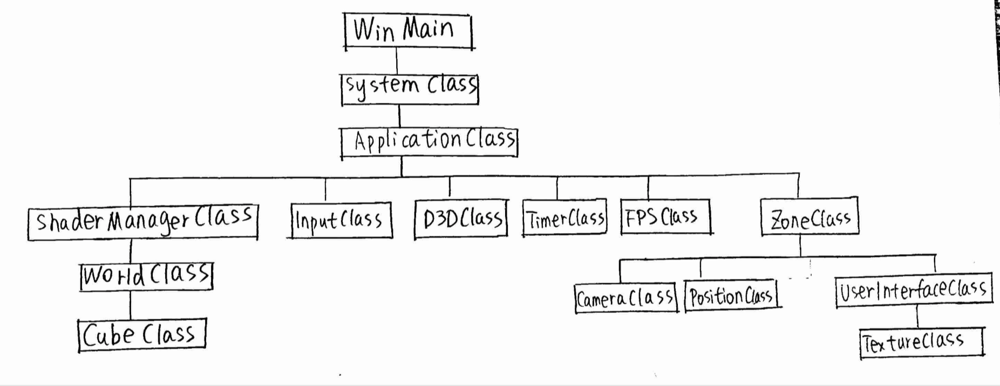
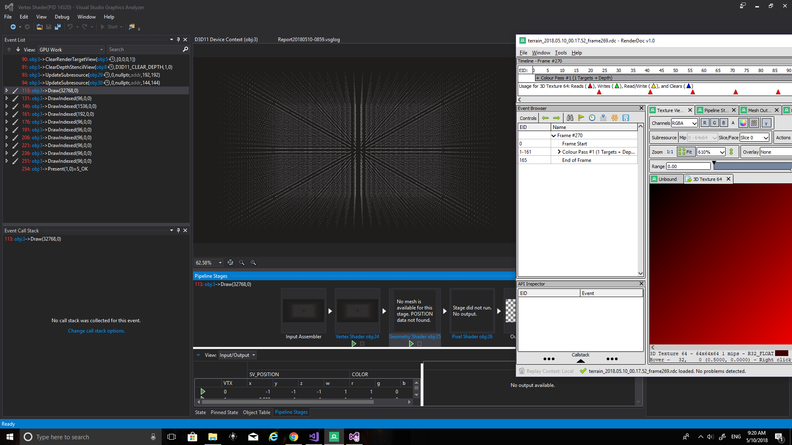

# procedural-infinite-terrain
Procedural infinite terrain implementation with:

1.marching cube algorithm

2.triplanar texture

3.phong lighting

Here is the demo:

The following diagram is a high level design for my project:

I use the basic framework from http://www.rastertek.com/tutdx11s2ter.html and add worldclass as chunk management, cubeclass as chunk generator, and marchingcube vertex, geometry and pixel shader.

For the marching cube algortihm, I recommend reading the following paper:

Voxel-Based Terrain for Real-Time Virtual Simulations By ERIC STEPHEN LENGYEL.

Some tips about debugging:

1.I use both Visual Studio's graphic debugging tool and RenderDoc. Both of them allow you to see the pipeline. 

Using Visual Studio, you have a visualization of VS, GS and PS and you can see the assembly code for shaders.

Using Renderdoc, you can debug each pixel and you are able to see the texture you pass to the resource view.

2.Chunk Wrapping problem

The first chunk has size 0 to width-1 and the second one has size width to 2width-1.

Between width-1 and width, there is an empty area. The solution is to have the correct offset of the second chunk.

Before:

After:

